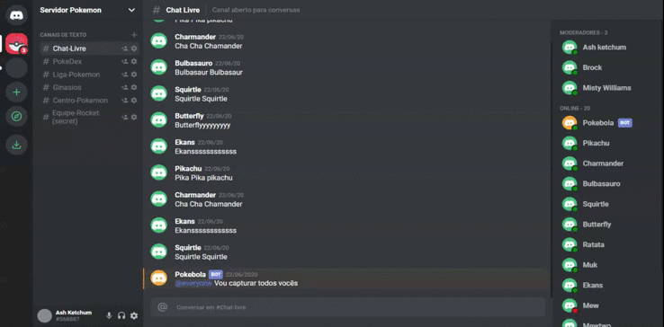

<p align="center">
    


<a href="https://www.linkedin.com/in/alquiponeto/">
    
</a>

<a href="https://github.com/Alquipo/React-Discord-Clone/commits/master">
    
</a>


[](https://app.netlify.com/sites/alquipo-discord-clone/deploys)

</p>

<p align="center">

  <a href="https://reactjs.org/">
    
  </a>
</p>

<h2 align="center">
  Desafio 04: Conceitos do React Native
</h2>

## 🚀 Sobre o desafio

Quarto desafio foi desenvolver um aplicativo Mobile onde mostra os dados dos repositórios da `API` desenvolvida no [Desafio 2][desafio2]. Foi adicionado no aplicativo Mobile a listagem dos repositórios e a função da de curtir os repositórios.

## 🎉 Melhorias

    - Convertido todo o Projeto para TypeScript
    - Refeito a interface do projeto para ficar um pouco melhor (não sou Designer)😊;
    - Adicionado a visualização da url, techs e curtidas;
    - Adicionado um botão para Criar Repositórios;
    - Adicionado um botão para Remover Repositórios;
    - Adicionado um botão para Ir para o Repositórios;
    - Efetuado Validação no texto para quando não tem curtidas;
    - Adicionado ícone no APP
    - Adicionado Splash Screen no APP
    - Alterado nome do App
    - Adicionado URL dinâmica no botão GitHub
    - Melhorado o TouchableOpacity do botão GitHub

## 🎨 Layout

<p align="center">

  
</p>

<p align="center">

<button><a href="https://alquipo-discord-clone.netlify.app/"></img></a></button>

</p>
## 🔨 Tecnologias:

- [TypeScript][typescript]
- [React Native][reactjs]
- [Axios][axios]

## 🚀 Como rodar este projeto

Para clonar e executar este aplicativo, você precisará de [Git](https://git-scm.com), [NodeJs][nodejs] Instalado em seu computador.

O projeto e divido em duas partes:

1. Back End [Repositório][desafio2]
2. Mobile

💡 E preciso efetuar o clone e seguir os passos de instalação do [Repositório da API][desafio2]

💡 O Mobile precisa que o Back End esteja sendo executado para funcionar.

### 🌀 Clonando o repositório

```bash
# Clone este repositório
$ git clone https://github.com/Alquipo/GoStack12-desafio-04

# Acesse a pasta do projeto no terminal/cmd
$ cd GoStack12-desafio-04
```

### 📱 Rodando a aplicação Mobile

```bash
# Instale as dependências
$ yarn

# Instale as dependências IOS (somente se for usar IOS)
$ cd ios
$ pod install

# Execute a Aplicação Android (somente se for usar Android)
$ yarn android

# Execute a Aplicação IOS (somente se for usar IOS)
$ yarn ios

# Execute o teste da Aplicação
$ yarn test

# O servidor inciará na porta:3333 - acesse http://localhost:3333
```

## 🤔 Como contribuir para o projeto

- Faça um **fork** do projeto;
- Crie uma nova branch com as suas alterações: `git checkout -b my-feature`
- Salve as alterações e crie uma mensagem de commit contando o que você fez:`git commit -m "feature: My new feature"`
- Envie as suas alterações: `git push origin my-feature`

> Caso tenha alguma dúvida confira este [guia de como contribuir no GitHub](https://github.com/firstcontributions/first-contributions)

## 📝 Licença

Este projeto esta sobe a licença MIT. Veja a [LICENÇA][license] para saber mais.

Feito com ❤️ por Alquipo Neto 👋🏽 [Entre em contato!](https://www.linkedin.com/in/alquiponeto/)

[reactjs]: https://reactnative.dev/
[nodejs]: https://nodejs.org/en/
[axios]: https://www.npmjs.com/package/axios
[rs]: https://rocketseat.com.br
[license]: https://opensource.org/licenses/MIT
[desafio2]: https://github.com/Alquipo/GoStack12-desafio-02
[typescript]: https://www.typescriptlang.org/
